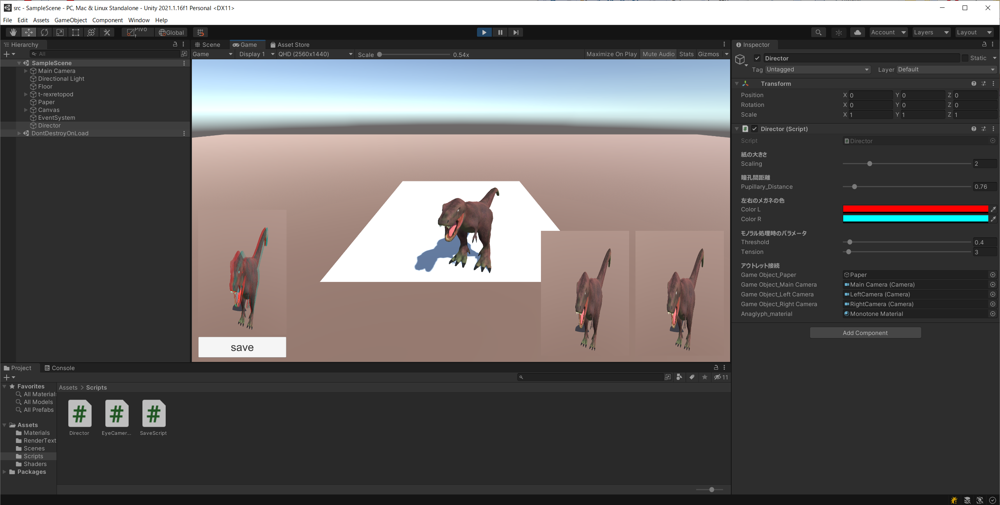

# about
子供の夏休みの自由研究でアナグリフをせがまれたので、プログラムを組んでみました

# 使い方
Unityのエディタ上での動作を想定しています。

「Director」オブジェクトがあるので、そのインスペクターからパラメータを調整します。
赤青以外の色のメガネにも対応可能です。

白い紙の範囲でテクスチャにレンダリングされるので、カメラやオブジェクトの位置を動かしてベストポジションを探してください。

「save」ボタンを押せば、result.pngという名前で保存されます。
